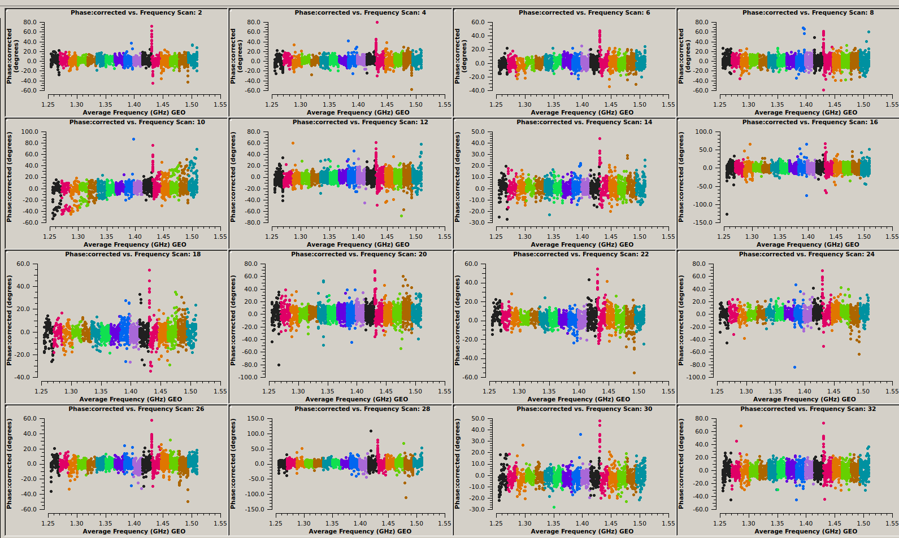
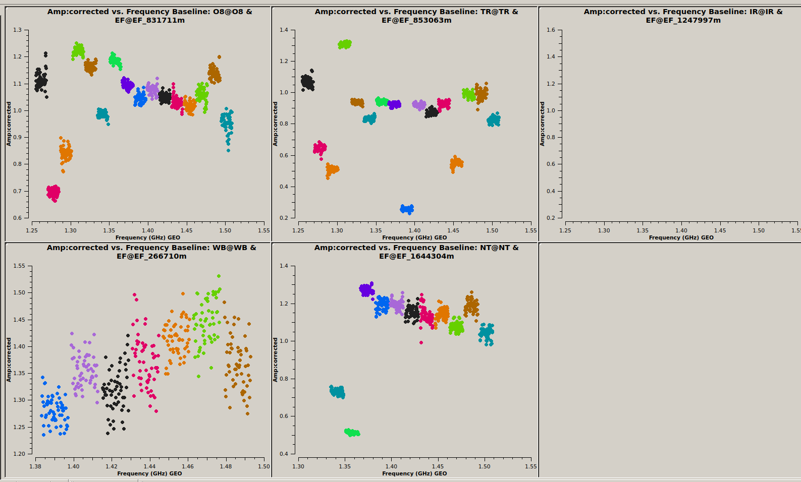
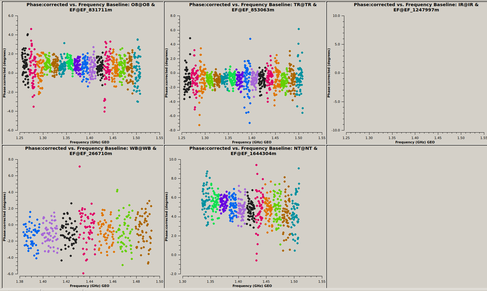

<!-- MathJax -->
<script src="https://cdnjs.cloudflare.com/ajax/libs/mathjax/2.7.7/MathJax.js?config=TeX-AMS-MML_HTMLorMML" type="text/javascript"></script>
<script type="text/x-mathjax-config">
    MathJax.Hub.Config({
      tex2jax: {
        skipTags: ['script', 'noscript', 'style', 'textarea', 'pre'],
        inlineMath: [['$','$']],
        displayMath: [['$$','$$']]
      }
    });
</script>

<script type="text/javascript">
var pcs = document.lastModified.split(" ")[0].split("/");
var date = pcs[1] + '/' + pcs[0] + '/' + pcs[2];
onload = function(){
    document.getElementById("lastModified").innerHTML = "Page last modified on " + date;
}
		</script>

<link href="styles.css" rel="stylesheet" />

<!-- Prism CSS -->
<link rel="stylesheet" href="https://cdnjs.cloudflare.com/ajax/libs/prism/1.29.0/themes/prism.min.css" />
<link id="prism-dark" rel="stylesheet" href="https://cdnjs.cloudflare.com/ajax/libs/prism/1.29.0/themes/prism-tomorrow.min.css" disabled />
<link rel="stylesheet" href="https://cdnjs.cloudflare.com/ajax/libs/prism/1.29.0/plugins/line-numbers/prism-line-numbers.min.css" />

<!-- Prism JS -->
<script src="https://cdnjs.cloudflare.com/ajax/libs/prism/1.29.0/prism.min.js"></script>
<script src="https://cdnjs.cloudflare.com/ajax/libs/prism/1.29.0/components/prism-python.min.js"></script>
<script src="https://cdnjs.cloudflare.com/ajax/libs/prism/1.29.0/plugins/line-numbers/prism-line-numbers.min.js"></script>

# FTSky VLBI workshop 2025

Welcome! This page hosts the VLBI tutorial material and guide from the [FTSky
Training School](https://www.icts.res.in/event/page/32854), held at on 06–10 October 2025.

I recommend to <span style="color:red">simply clone this repository</span> and then work in the `tutorial` directory:

```bash
cd /somewhere/on/your/laptop
git clone https://github.com/pharaofranz/ftsky_school_vlbi_2025.git
cd ftsky_school_vlbi_2025/tutorial
```

If you prefer to work in a different directory, just make sure to copy the python scripts
in the `tutorial` directory across.

## On this page
1. [Introduction](#introduction)
2. [Download the data](#download-the-data)
3. [How to handle the containers](#how-to-handle-the-containers)
4. [Tutorial](#tutorial)
5. [Bonus questions](#bonus-questionstasks)
6. [Resources](#resources)
7. [References](#references)

## Introduction
In this tutorial we will use public data from EVN-experiment
[EK048D](https://archive.jive.nl/scripts/arch.php?exp=EK048D_210410) to try and localise
the repeating fast radio burst source FRB20201124A. The full data analysis and
interpretation can be read up on in [Nimmo et al. 2022](#nimmo2022).

## Download the data
First download the data from the EVN archive as indicated below. We'll need the correlated
fitsidi files as well as the system temperature files and the automatically generated flag
files.

<span style="color:red"> **Ideally you download all of this before the tutorial.** </span>

In total you'll need some 35GB of free space on your laptop.

```bash
wget -t45 -l1 -r -nd https://archive.jive.eu/exp/EK048D_210410/fits -A "ek048d*"
wget https://archive.jive.nl/exp/EK048D_210410/pipe/ek048d.uvflg
wget https://archive.jive.nl/exp/EK048D_210410/pipe/ek048d.antab.gz
gunzip ek048d.antab.gz
```

## How to handle the containers
We prepared both docker and apptainer containers for your convencience. They contain all
the software that you'll need.

<span style="color:red"> **Please make sure to have one of them on your laptop before
the tutorial.** </span>

### Docker
- install docker following the [installation instructions](https://docs.docker.com/engine/install/)
- pull the image from docker

```bash
docker pull apal52/radio-img
```

- prepare your environment to allow X-forwarding from the docker container

```bash
xhost +local:docker
# may also need
xhost +local:root
```

- spin up the container to run things "interactively". Note here we name the container
  `vlbi-tutorial` -- **this is deliberate** because we want to mount a different directory into '/data'.

```bash
# first go to where you downloaded the data to; this should be the 'tutorial' directory
# of this very git repo that you cloned
cd /path/to/ftsky_school_vlbi_2025/tutorial

# then spin up the container but give it a new name
docker run -it --name vlbi-tutorial \
   --privileged -e DISPLAY=$DISPLAY \
   -e QT_X11_NO_MITSHM=1 -v /tmp/.X11-unix:/tmp/.X11-unix --ipc=host \
   -v $(pwd):/data apal52/radio-img
```

- test if things are working correctly:
  - If you see errors about `fuse` and `fusermount` you may have forgotten to add
    `--privileged`
  - Try to start up `casaviewer` (just type it at the prompt and hit `return`). If you get
    two windows where you can open files and no errors are printed to the prompt you're
    all good to go.
  - In case you get errors about x-forwarding not working, you may have forgotten to add
    `-e DISPLAY=$DISPLAY`

### Apptainer
In case you'd like to try out apptainer instead of docker (most HPC systems do not allow
docker containers to be run on their systems), there is also an aptainer image available:
- install apptainer following the [installation instructions](https://apptainer.org/docs/admin/main/installation.html)
- download the image

```bash
wget https://franzkirsten.de/ftsky.simg
```

- start up the image to work "interactively"

```bash
singularity shell -e --env DISPLAY=$DISPLAY --fakeroot -B /path/to/data:/data ftsky.simg
```

- test if things are working correctly:
  - If you see errors about `fuse` and `fusermount` you may have forgotten to add
    `--fakeroot`
  - Try to start up `casaviewer` (just type it at the prompt and hit `return`). If you get
    two windows where you can open files and no errors are printed to the prompt you're
    all good to go.
  - In case you get errors about x-forwarding not working, you may have forgotten to add
    `--env DISPLAY=$DISPLAY`
  - In case windows do pop up but they're just gray and there are loads of error messages
    on the prompt, you may need to `exit` from the container and run `xhost +local:root;
    xhost +local:apptainer`; and then start the container again.

## Tutorial
Now, with the technical bits out of the way, we can start the tutorial. Some of the
tedious first bits are easier run in a scripted way -- feel free to take a closer look at
what's happening or just run the scripts.

All of the below assumes that you're in an interactive session in the container and that
you've successfully entered into an interactive casa session by running:

```bash
casa

# and change into the directory where all our data are (it was mounted into /data)
cd /data
```

This should give you the familiar ipython prompt and a logging window should have popped up.

We'll run the calibration and imaging step by step but in case you'd like to just get to
the end run the full calibration script like so in casa:

```python
run -i -e './full-cal.py'
```

This will skip all of the intermediate plots and get you calibrated CLEAN images of the
check source and calibrated dirty images of the target source.

Let's do things step by step.

### Preliminary steps
- to get the JIVE pipeline tables into casa; i.e. append the system temperature tables to
the fitsidi files and also create a `casa`-ready flag table.

```python
run -i -e './add-jive-tables.py'
```

### Basic steps
- Load the data into casa

```python
# define a few varibles that hold names of different measurement sets
CONT='ek048d_cont.ms'
GATE='ek048d_gate.ms'
PCAL='pcal.ms'
CHKSRC='chksrc.ms'

import glob
# get a sorted list of fitsidi files, one for the continuum data and one for the gated data.
cont_idifiles = sorted(glob.glob('ek048d_1_*IDI*'))
gate_idifiles = sorted(glob.glob('ek048d_2_*IDI*'))

importfitsidi(fitsidifile=cont_idifiles, vis=CONT, constobsid=True, scanreindexgap_s=15.0)
importfitsidi(fitsidifile=gate_idifiles, vis=GATE, constobsid=True, scanreindexgap_s=15.0)
```

- Do take a look at what's happening in the logger while the above is running.
- We can take a look and get a summary of the observations in the following way:

```python

listobs(vis=CONT, overwrite=True, listfile='listobs_cont.txt')
listobs(vis=GATE, overwrite=True, listfile='listobs_gate.txt')
```
- and take a look via

```bash
less listobs_cont.txt  # this contains pretty much all the data
less listobs_gate.txt  # here you will see only the gated data; in total there were 13 bursts that now appear as separate scans of 2s duration each
```

- let's apply some flagging -- we're getting rid of the band edges, the autocorrelations,
  some bad IFs and other time when the stations were not observing

```python
run -i -e './flagging.py'
```

- Now we'll apply some a-priori amplitude calibration using the provided system
  temperature curves. The idea here is to get the fluxes of the sources right based on
  the known SEFDs of each station and the measured system temperature at the time.

> **NOTE:** You will see a lot messages on the prompt telling you that "Tsys for ant id=XY
> in spw YX are all negative or zero. This is fine because not all antennas observed all
> subbands. We have a so-called mixed-band setup where different antennas cover different
> parts of the band. Only Effelsberg, Onsala and Torun completely overlap.

```python
run -i -e './apriori-cal.py'
```

### Calibration
With the generic stuff out of the way, we can now approach calibration.

#### Manual fringe fit (single-band-delay corrections)
The first thing to do will be to correct for instrumental delays. As the different IFs
pass through different electronics, there are systematic offsets (aka delays) between
the phases of each subband. Using a minute of data on a bright source -- here the fringe
finder -- we'll correct for this offest.

- take a look at the **uncalibrated** phases and amplitudes of the fringe finder ([Figure 1](#fig-1) and
  [Figure 2](#fig-2))

```python
plotms(vis=CONT, gridrows=2, gridcols=3,
       xaxis='frequency', yaxis='phase', field='J0530+1331',
       timerange='15:02:00.0~15:03:00.0', avgtime='60',
       iteraxis='baseline', coloraxis='spw', correlation='RR', antenna='EF')
```


<a name="fig-1">**Figure 1**</a> - *Uncalibrated phases of the fringe finder. Each panel
is a different baselines with Effelsberg and the subbands (IFs) are color coded. Slopes and offsets between
bands are obvious. They are caused by instrumental delays and imperfections in the
correlator model.*


<a name="fig-2">**Figure 2**</a> - *Same as [Figure 1](#fig-1) but for the amplitudes.*

- now we run so-called "manual fringe fit"; or in casa-speak "single-band-delay"
  correction.

```python
fringefit(vis=CONT, caltable='cont.sbd', timerange='15:02:00.0~15:03:00.0',
          solint='inf', zerorates=True, refant='EF', minsnr=10,
          gaintable=['cal.gcal', 'cal.tsys'],
          interp=['nearest','nearest,nearest'],
          parang=True)
```

- we apply the single band delay corrections to the fringe finder

```python
applycal(vis=CONT, field='J0530+1331',
         gaintable=['cal.gcal', 'cal.tsys', 'cont.sbd'],
         interp=['nearest','nearest,nearest', 'nearest'],
         parang=True)
```

- and take a look at the outcome ([Figure 3](#fig-3))

```python
plotms(vis=CONT, gridrows=2, gridcols=3, xaxis='frequency', yaxis='phase',
       field='J0530+1331',timerange='15:02:00.0~15:03:00.0',
       avgtime='60', iteraxis='baseline', coloraxis='spw',
       correlation='RR', antenna='EF',
       ydatacolumn='corrected')
```


<a name="fig-3">**Figure 3**</a> - *Same as [Figure 1](#fig-1) but with instrumental
delays corrected. The phases are now mostly flat, centered around zero and "connected"
across the band.*


#### Global fringe fitting
Now we can move ahead and solve for delays and rates across the entire observations for
the phase calibrator and the fringe finder.

- We run global fringe fit, applying all previous calibration on the fly and ask for one
  solution per phase calibrator scan (note how we average over all IFs to increase the
  signal-to-noise by passing `combine='spws'`):

```python
fringefit(vis=CONT, caltable='cont.mbd', field='J0502+2516, J0530+1331',
          solint='120s', zerorates=False, refant='EF', minsnr=7, combine='spw',
          gaintable=['cal.gcal', 'cal.tsys', 'cont.sbd'],
          interp=['nearest','nearest,nearest', 'nearest'],
          parang=True)
```

- apply the fringe fit calibration (we have to specify how to apply the global fringe fit
  solutions because we obtained only one set of solutions by averaging over all subbands)

```python
nspw = 16
applycal(vis=CONT, field='J0502+2516, J0530+1331',
         gaintable=['cal.gcal', 'cal.tsys', 'cont.sbd', 'cont.mbd'],
         interp=['nearest','nearest,nearest', 'nearest', 'linear'],
         parang=True, spwmap=[[],[],[], nspw * [0]])
```

- Plot the calibrated phases, but only on Effelsberg baselines ([Figure 4](#fig-4)). We
  generate one plot per scan to see if there are scans with failed calibration.

```python
plotms(vis=CONT, gridrows=4, gridcols=4, xaxis='frequency', yaxis='phase',
       field='J0502+2516', avgtime='60', iteraxis='scan', coloraxis='spw',
       correlation='RR, LL',ydatacolumn='corrected',
       avgchannel='8', antenna='EF')
```



<a name="fig-4">**Figure 4**</a> - *Calibrated phases per scan for the phase calibrator on
all baselines involving the Effelsberg telescope. The phases are flat across the band and
scattered around zero. The color-coding is per subband (IF). It seems there is a
particular frequency range affected by RFI -- try and flag it later on to improve the calibration.*


#### Bandpass calibration

As each subband has a certain spectral response (see [Figure 2](#fig-2)). However, we
expect our calibrators to have a flat spectrum across the band. Therefore,  we will create a bandpass calibration table,
again running on a bright, flat-spectrum source such as our fringe finder:

```python
bandpass(vis=CONT, caltable='cont.bpass', field='J0530+1331',
         gaintable=['cal.gcal', 'cal.tsys', 'cont.sbd', 'cont.mbd'],
         interp=['nearest','nearest,nearest', 'nearest', 'linear'],
         spwmap=[[],[],[],nspw * [0]],
         solnorm=True, solint='inf', refant='EF', bandtype='B',
         parang=True,
         minblperant=1)
```

- we can plot the results ([Figure 5](#fig-5)):

```python
plotms(vis='cont.bpass', xaxis='frequency', yaxis='amp',
       coloraxis='corr', iteraxis='antenna', gridrows=2, gridcols=3)
```


<a name="fig-5">**Figure 5**</a> - *Bandpass calibration generated from phase-calibrated
data of the fringe finder.*


- We can now apply all of the calibration, including the bandpass table to both the fringe
  finder and the phase calibrator:

```python
applycal(vis=CONT, field='J0502+2516, J0530+1331',
         gaintable=['cal.gcal', 'cal.tsys', 'cont.sbd', 'cont.mbd', 'cont.bpass'],
         interp=['nearest','nearest,nearest', 'nearest', 'linear', 'nearest,nearest'],
         spwmap=[[],[],[], 16 * [0], []], parang=True)
```

- And we can plot the fully calibrated amplitudes of the fringe finder. Here
  we again restrict outselves to the baselines that involve the Effelsberg telescopy
  ([Figure 6](#fig-6) and [Figure 7](#fig-7)).

```python
plotms(vis=CONT, gridrows=2, gridcols=3, xaxis='frequency', yaxis='amp',
       field='J0530+1331',timerange='15:02:00.0~15:03:00.0',
       avgtime='60', iteraxis='baseline', coloraxis='spw',
       correlation='RR', antenna='EF',
       ydatacolumn='corrected')
```



<a name="fig-6">**Figure 6**</a> - *Fully calibrated amplitudes of the fringe finder on
all Effelsberg baselines. Compare this to [Figure 2](#fig-2). There is certainly room for
improvement or more flagging but this is certainly "good enough".*



<a name="fig-7">**Figure 7**</a> - *Same as [Figure 6](#fig-6) but for the phases. Now
they are all flat.*


### Imaging
With all the calibration done, we can now image our data.

#### Check if calibration was successful
Before we image our targets, we'll check if the calibration was actually successful. In
this particular observation, we observed a check source that we used to assess the quality
of our astrometry. We will now use it to check if our calibration was successful at all.

- apply the calibration to the check source

```python
applycal(vis=CONT, field='J0501+2530',
         gaintable=['cal.gcal', 'cal.tsys', 'cont.sbd', 'cont.mbd', 'cont.bpass'],
         interp=['nearest','nearest,nearest', 'nearest', 'linear', 'nearest,nearest'],
         spwmap=[[],[],[], nspw * [0],[]],
         parang=True)
```

- For quicker and easier imaging, we split out the check source and create a new
  measurement set that only contains the calibrated data. We also apply some averaging on the fly:

```python
split(vis=CONT, outputvis=CHKSRC, field='J0501+2530',
      correlation='RR, LL', datacolumn='corrected',
      keepflags=False,
      width='4', timebin='32s')
```

- We can now image the check source, we restrict ourselves to all Eff-baselines.

```python
tclean(vis=CHKSRC, imagename='chksrc.image', specmode='mfs', nterms=1,
       deconvolver='hogbom', gridder='standard', imsize=128, cell='5mas',
       weighting='natural', niter=100, interactive=False, savemodel='modelcolumn',
       restart=False,
       antenna='5&0; 5&1; 5&2; 5&3; 5&4')
```

- Take a look at the output with `imview`. The file you'll want to look at is called
  `chksrc.image.image` ([Figure 8](#fig-8))

```python
imview('chksrc.image.image')
```


<a name="fig-8">**Figure 8**</a> - *CLEANed image of the check source.*

#### Finally image the target FRB
Since we're happy with our calibration -- the check source is a lovely point source located at the right position -- we
can now apply the calibration to our gated target data and image it.

- apply calibration to target -- make sure to use the correct gcal and tsys

```python
applycal(vis=GATE, field='R67_D',
         gaintable=['r67.gcal', 'r67.tsys', 'cont.sbd', 'cont.mbd', 'cont.bpass'],
         interp=['nearest','nearest,nearest', 'nearest', 'linear', 'nearest,nearest'],
         parang=True,
         spwmap=[[],[],[],nspw * [0], []])
```

- In case of the targets, we do not run a full CLEAN on the data because, well, all we
have are snapshots that last only a few milliseconds. Thus, we only get the dirty image
for all bursts individually. Again, we restrict ourselves to the Eff baselines. For
convenience we run the imaging in a for loop, looping over the bursts (or scans here):

```python
for i in range(1,14):
    tclean(vis=GATE, scan=str(i), imagename='burst'+str(i)+'.image',
           specmode='mfs', nterms=1, deconvolver='hogbom', gridder='standard',
           imsize=1024, cell='5mas', weighting='natural', niter=0,
           savemodel='modelcolumn', restart=False,
           antenna='EF&O8; EF&TR; EF&WB; EF&NT')
```

- you can again take a look at the individual bursts with `imview`. The files will be
  called `burst[1-13].image.image` (see [Figure 9](#fig-9) for the dirty image of Burst 1.)

```python
# to open all 13 bursts in one go
from natsort import natsort_keygen
burst_images = sorted(glob.glob('burst*.image.image'), key=natsort_keygen())
imview(burst_images)
```


<a name="fig-9">**Figure 9**</a> - *Dirty image of burst 1. Note the cross pattern that
shows that the signal is dominated by two baselines.*

- in the viewer you can animate the 13 bursts to loop through.
- As you can see, we do not get a clear localisation with just a single burst. What we see
  is the cross-pattern of the different baselines, dominated by one or two of them.
- What you might also see, is that the cross-pattern "rotates" in time -- this is
  Earth-rotation synthesis at work! As time progresses, the relative locations between
  telescopes and target change and we thus fill the UV-plane.
- If we're lucky, combining all bursts will give us an unambiguous localisation:

```python
tclean(vis=GATE, scan='1~4,6~13', imagename='burst_all_but5.image',
       specmode='mfs', nterms=1, deconvolver='hogbom', gridder='standard',
       imsize=1024, cell='5mas', weighting='natural', niter=0,
       savemodel='modelcolumn', restart=False,
       antenna='EF&O8; EF&TR; EF&WB; EF&NT')
```

- And TADA, we do get a single peak in the dirty image ([Figure 10](#fig-10)).


<a name="fig-10">**Figure 10**</a> - *Dirty image of all 12 bursts combined (we're ignoring
burst 5 here). The combination of bursts occuring at different times leads to a more
filled uv-plane and, eventually, gives us a single peak in the dirty image. This is the
precise localisation of the target source.*

## Bonus questions/tasks
- In [Figure 9](#fig-9) we see that two baselines dominate the cross pattern. Which
  baselines are these and how would you figure it out?
- Make the same image as [Figure 10](#fig-10) but including all baselines. In what way are
  the images different/similar and why?
- Why is the check-source in the middle of the created figure ([Figure 8](#fig-8)) while
  the FRB-source is not ([Figure 10](#fig-10))?
- For the fun of it you can also image the phase calibrator source
  (`field='J0502+2516,'`). I would suggest you restrict yourself to 3 scans spread across
  the obsevation as imaging all scans at once takes a long time in Casa.
- You can also try and create a deep image of the target field by applying all calibration
  to the target (`field='R67_D'`) in the measurement set that contains all the data
  (i.e. the one we referred to as `CONT`); then split out the target and image with
  `tclean`. Note that the imaging process might take a long time as it's a fair bit of
  data. Maybe try this out on one scan only at first.

## Resources
The calibration steps above are largely just following what other tutorials have done
before. In particular, you can also look at the following:
- [JIVE VLBI school tutorial](https://indico.astron.nl/event/390/page/254-data-reduction-guide)
- [EVN data reduction guide](https://evlbi.org/evn-data-reduction-guide) -- this one also
  describes how to use AIPS.
- [ERIS-2024 school](https://eris2024.iaa.csic.es/index.html)
- [General CASA VLBI tutorials](https://casaguides.nrao.edu/index.php/VLBI_Tutorials)

## References
<a name="nimmo2022">1.</a> Nimmo, K., et al., “Milliarcsecond Localization of the
Repeating FRB 20201124A”, *ApJL*, 927 (1), L3-L15 (2022). DOI: [10.3847/2041-8213/ac540f](https://ui.adsabs.harvard.edu/link_gateway/2022ApJ...927L...3N/doi:10.3847/2041-8213/ac540f){:target="_blank"}

---

_Content built by Franz Kirsten._ <i><span id="lastModified"></span></i>

_Built with ♥ — Markdown + HTML + CSS + Prism.js + a bit of AI + Jack Radcliffe (2025)_

<!-- Custom Script: funcs.js -->
<script>
    const copy = (el) => {
      const pre = document.querySelector(el);
      if (!pre) return;
      const code = pre.innerText;
      navigator.clipboard.writeText(code).then(() => {
        const btn = document.querySelector(`[data-copy="${el}"]`);
        if (!btn) return;
        const old = btn.textContent;
        btn.textContent = 'Copied!';
        setTimeout(() => (btn.textContent = old), 1500);
      });
    };
    document.addEventListener('click', (e) => {
      const t = e.target;
      if (t.matches('.copy-btn')) {
        const target = t.getAttribute('data-copy');
        copy(target);
      }
    });
</script>
